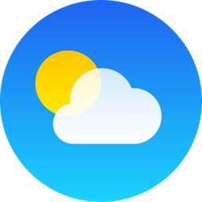

# Weather Desk

Weather Desk is a weather app that provides detailed and accurate
weather forecasts for locations around the world.

See live [demo](https://weatherdesk.netlify.app)

### Steps to run locally:

1. Make sure `node` is installed on your system.
2. Create `.env` from `.env.sample`. You can get your `API_KEY` from [AccuWeather](https://developer.accuweather.com/accuweather_custom/package/purchase/free/free)

3. Run `./scripts/run.sh` and app will start on `http://localhost:3000`
